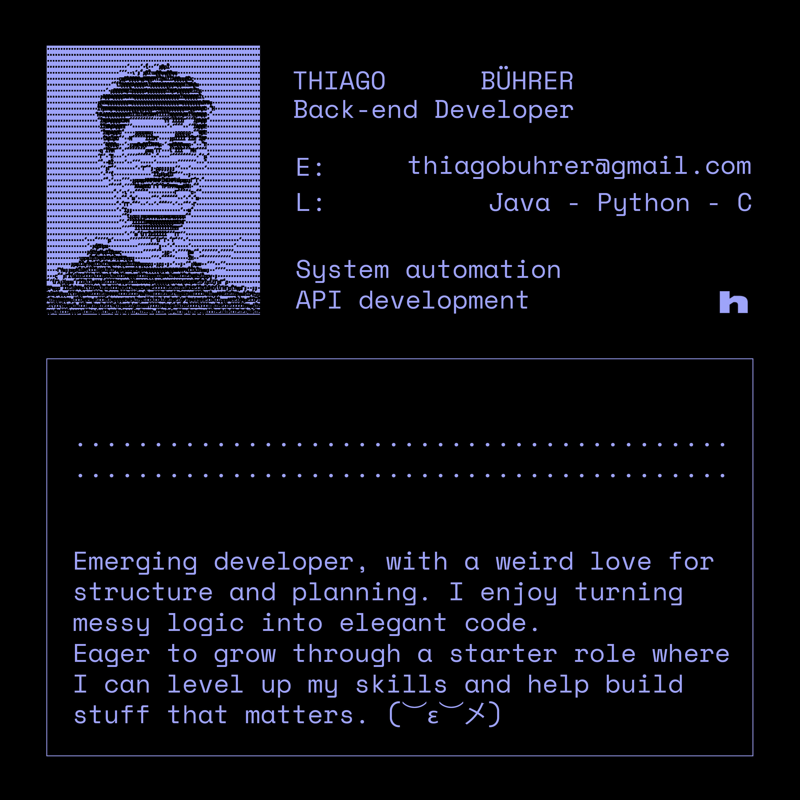

<!-- Profile Image -->

  

<!-- Tech Stack -->

### MY TECH STACK:

 

 

 

 

 

<!-- Languages Overview -->

<!-- Typing SVG -->

<!-- Contacts -->

  <!-- LinkedIn -->
  
  &nbsp;&nbsp;&nbsp;
  <!-- Email -->
  
  &nbsp;&nbsp;&nbsp;
  <!-- GitHub -->
  

- uses: Platane/snk@v3
  with:
    # github user name to read the contribution graph from (**required**)
    # using action context var `github.repository_owner` or specified user
    github_user_name: ${{ github.repository_owner }}

    # list of files to generate.
    # one file per line. Each output can be customized with options as query string.
    #
    #  supported options:
    #  - palette:     A preset of color, one of [github, github-dark, github-light]
    #  - color_snake: Color of the snake
    #  - color_dots:  Coma separated list of dots color.
    #                 The first one is 0 contribution, then it goes from the low contribution to the highest.
    #                 Exactly 5 colors are expected.
    outputs: |
      dist/github-snake.svg
      dist/github-snake-dark.svg?palette=github-dark
      dist/ocean.gif?color_snake=orange&color_dots=#bfd6f6,#8dbdff,#64a1f4,#4b91f1,#3c7dd9
      